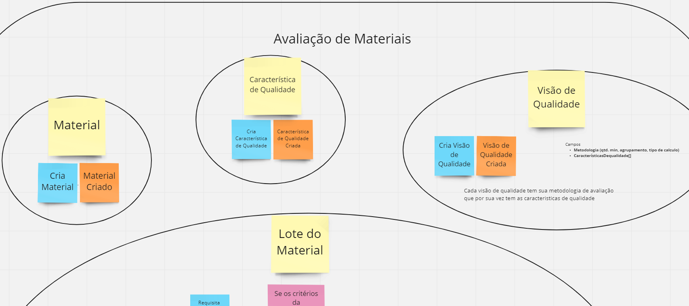
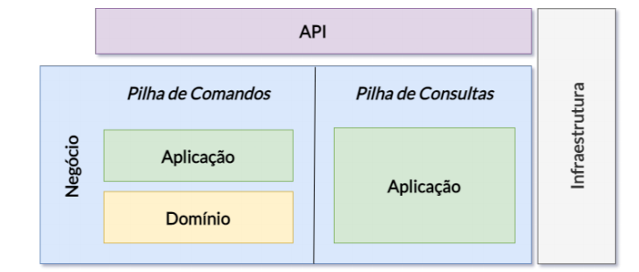
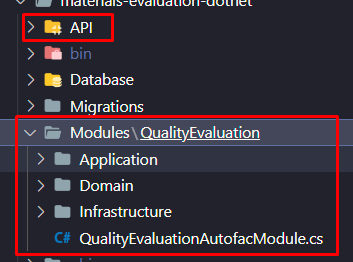

# Avaliação de Materiais

Sistema para avaliação de qualidade.

Voltado para lotes de materiais que possuem visões de qualidade. O sistema possui cadastros de materiais, características de qualidade, visões de qualidade e lotes de materiais. A partir disso é calculado se cada lote está dentro da faixa, ou seja, atende todos os critérios.

## Iniciar o Projeto

O projeto foi desenvolvido utilizando Docker. Suba o docker-compose e o projeto estará rodando no endereço: `http://localhost:4200`.

Comando para iniciar o Docker:

`docker compose -f "docker-compose.yml" up -d --build`

## Disclaimer

Foi a primeira vez que programei pra valer em .NET e Angular. Por conta disso, podem ter erros de estilo por não estar acostumado com C# (ainda), e provavelmente há jeitos mais fáceis de fazer certas conversões, por exemplo nos DTOs. Por conta disso, acabaram faltando alguns itens necessários para a total conclusão do projeto. Agora que entendi como funciona o .NET, provavelmente o tempo seria cortado pela metade (muito do tempo foi gasto entendendo configuração de framework e etc). No entanto o saldo é positivo, consegui um bom conhecimento inicial em C# e Angular e estou pronto para aprender mais a fundo tais ferramentas.

### Tarefas Concluídas

- [x] ~Modelagem do domínio com Event Storming~
- [x] ~Adicionar Docker ao Angular + .Net
- [x] ~Adicionar Lint ao .NET e Angular (CI/CD)~
- [x] ~Adicionar CQRS e Arquitetura Hexagonal usando injeção de dependencias (AutoFac)~
- [x] ~Adicionar migrations com Entity Framework~
- [x] ~Adicionar SQL Server + conexão Entity Framework ao projeto~
- [x] ~CRUD de Materiais~
- [x] ~CRUD de Características de Qualidade~
- [x] ~CRUD de Visões de Qualidade~
- [x] ~CRUD de Lotes~
- [x] ~CRUD de Ensaios de qualidade - com form obedecendo a visão~
- [x] ~Criar templante em Angular com Angular Material~
- [x] ~Adicionar validação de Inputs com FluentValidation~
- [x] ~Calcular Resultado de Qualidade do Lote (Regra de negócio)~

### Tarefas Futuras

- [ ] Adicionar Flexbox aos formulários e organizar corretamente os inputs
- [ ] Adicionar .env ao Angular e .NET
- [ ] Adicionar EventBus
- [ ] Enviar Resultado da qualidade do lote por Email(MailKit) como Notificação (Integration Event)
- [ ] Corrigir CI do NodeJS
- [ ] Migrar "Materiais" E "Características" para Arquitetura Hexagonal (Atualmente tudo está no controller)
- [ ] Adicionar Codeclimate ao Projeto
- [ ] Adicionar Testes + Codecov para verificar cobertura (coverage)
- [ ] Adicionar Badges
- [ ] Editar Visão de Qualidade
- [ ] Editar Lote
- [ ] Editar/Exclui Ensaios Adicionados ao Lote
- [ ] Adicionar RabbitMQ para consumir Eventos (EventConsumer em docker separado)
- [ ] Refatorar arquitetura do front-end para arquitetura hexagonal
- [ ] Corrigir todos os FIXMEs e TODOs presentes no código
- [ ] Adicionar mais validações para todos os forms (back e front)
- [ ] Adicionar tratamento de erro de API (front)
- [ ] Adicionar central de notificações

## Modelagem

Para a modelagem do domínio, foi utilizado Event-Storming, que se trata de uma técnica que utiliza os conceitos do DDD para modelar um domínio. Tudo isso baseado em eventos. A imagem abaixo explica como funciona os diversos componentes dessa modelagem.

(créditos: https://medium.com/xp-inc/event-storming-guia-b%C3%A1sico-216498f5dd2d)

### Modelagem do Domínio de Avaliação de Qualidade

A modelagem resultou na criação de 4 agregados para descrever o domínio.

Já a parte de cálculo, foi modelada de forma a levar em consideração todo o seu fluxo:

Com a modelagem ficou claro como o código do projeto seria desenvolvido para atender os requisitos.

## Arquitetura

A arquitetura do projeto foi escolhida baseado na idéia de que se um projeto começa da forma correta (bem arquitetado), ele se mantém ao longo do tempo constante em termos de manutenabilidade. Pois projetos iniciados sem arquitetura tendem a se tornam uma "Big Bal Of Mud" ao passar do tempo.

Para isso, foi utilizado uma arquitetura hexagonal (ou ports and adapters), ou seja, o sistema é dividido em camadas, onde as camadas mais acima conhecem as camadas de baixo, mas as camadas de baixo não conhecem as acima dela. Isso facilita na inversão de dependências, já que o domínio, que é a camada mais interna não conhece as demais, ou seja, as regras de negócios ficam protegidas longe da lógica que trata de banco de dados, cache e etc. Tudo isso torna o sistema mais reutilizável e modular. Facilitando a manutenção, apesar de iniciar uma arquitetura assim ser mais demorado, o prejuízo inicial compensa a médio e longo prazo.

### CQRS - Command Query Responsibility Segregation.

Foi utilizado o padrão CQRS para separação da stack de comandos e stack de queries, ou seja, existem dois modelos dentro do sistema, um de consulta e outro de comandos. Tal separação ajuda na indepêndencia dos modelos de consulta dos comandos, utilizando de data transfer objects.

Essa separação ajuda na manutenção das consultas, caso elas sejam complexas (envolvendo mts joins), elas são feitas de forma separada, podendo atender melhor os front-ends.

Obs: Para o roteamento, foi utilizado o MediatR do .NET.

A figura abaixo demonstra a organização dos módulos do sistema utilizando os padrões explicados acima:

## Paterns Utilizados

- Mediator
- Command / Command Handler
- Unit Of Work
- Injeção de Dependencias
- Repositórios
- Data Transfer Objects (DTOs)
- Domain-Driven Design (Entidades, Agregados, Eventos, Objetos de Valor)
- ~Strategy~ (Será utilizado no cálculo dos critérios de qualidade)

## Bibliotecas Principais Utilizadas

### Backend (.NET)

- ASP.NET Core 7
- AutoFac para Injeção de dependencias
- FluentValidation para validação de comandos/queries
- MediatR para rotear as chamadas dos comandos/queries
- EntityFramework (+Extensões) como ORM e criação das migrações do banco
- Roslynator e StyleCop para análise estática do código, para seguir os padrões corretos da linguagem
- SQL Server 2022 como banco de dados

### Front-end (Javascript)

- Angular como framework principal da aplicação
- Angular Material para componentes utilizados
- Luxon para tratamento de datas

## Referências

- Arquitetura Limpa - Robert Martin
- Implementando Domain - Driven Design - Vaugh Vernon
- [Meu TCC](https://faceel.unifesspa.edu.br/images/works/TCC/EC/TCC_II___Torugo___FINAL.pdf)
- [.NET Microservices: Architecture for Containerized .NET Applications](https://learn.microsoft.com/en-us/dotnet/architecture/microservices/)
- [Modular Monolith: Domain-Centric Design](http://www.kamilgrzybek.com/design/modular-monolith-domain-centric-design/)
- [Como fazer Event Storming — Introdução](https://medium.com/xp-inc/event-storming-guia-b%C3%A1sico-216498f5dd2d)

## Cheatsheet

### Rodar Front-end Localmente

`cd materials-evaluation-spa`

`ng serve`

### C# Scaffolds

`dotnet aspnet-codegenerator controller -name MaterialsController -async -api -m Material -dc DatabaseContext -outDir API/Controllers`

### Migrations

`dotnet ef migrations add NomeDaMigration`

`dotnet ef database update`

`dotnet ef migrations remove --force`
